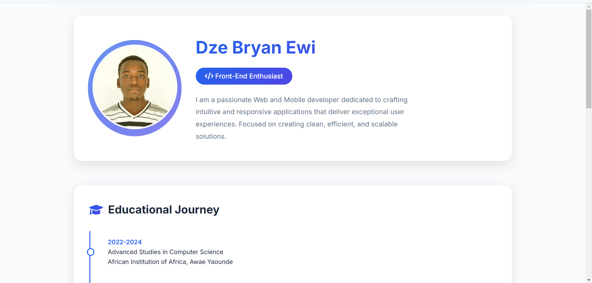
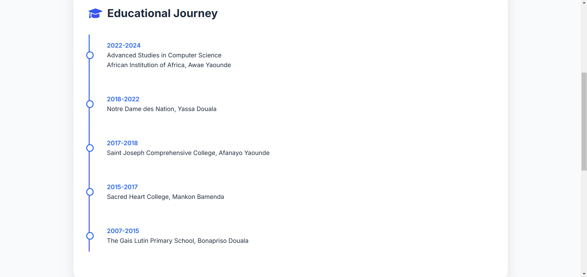
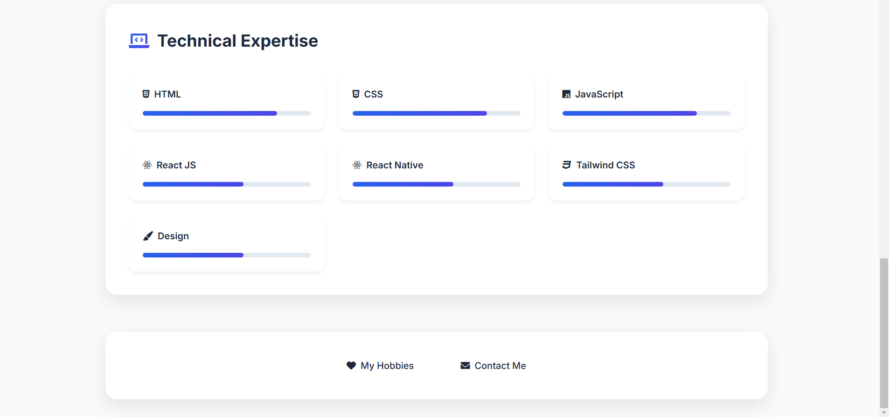
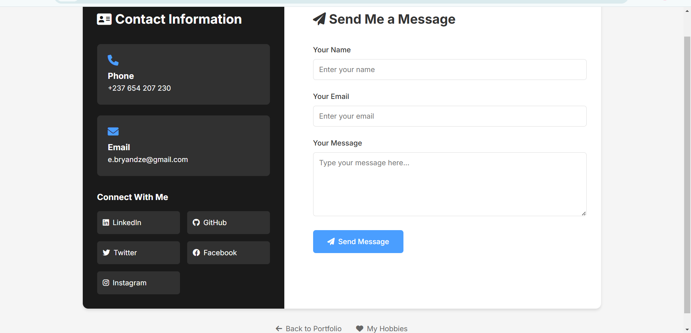

# CV Website

This is a personal CV website showcasing skills and schools attended. It is built to serve as an interactive and dynamic representation of my resume.

## Features

- **Home Section**: A brief introduction and personal statement.

- **Hobbies Section**: Detailed information about what i love doing.

- **Contact Section**: A form for visitors to get in touch and links to my social profiles.
    
## Technologies Used

- **Frontend**: [HTML] for a responsive and interactive user interface.
- **Styling**: CSS modules and styled components for custom designs.
- **Hosting**: Deployed using [Github]

## Contact

Feel free to reach out with feedback or inquiries:

- **Email**: [e.bryandze@gmail.com]
- **LinkedIn**: [www.linkedin.com/in/dzebryan237]
- **GitHub**: [https://github.com/G-Bryan237]

---

Thank you for visiting my CV website!

